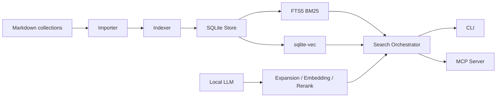

# Knowshelf 架构设计

本文档描述一个用 Go 实现的个人书籍知识库。输入格式是 Markdown，对外提供 MCP 服务。默认方案要求**检索逻辑完全遵循 qmd**：本地 SQLite 作为唯一事实源，Markdown 被增量导入为可检索文档，BM25 与向量检索并行召回，RRF 融合，候选 chunk rerank，最终通过 MCP 暴露 `query/get/multi_get/status` 等能力。

有更好的方案时，本文只放到「需确认的改进项」章节，不进入默认实现。

## 1. 背景

目标是把个人书籍、读书笔记、摘录、主题材料统一导入为本地 Markdown 知识库，让 LLM/Agent 能通过 MCP 精确检索、读取、引用内容。

qmd 的核心不是聊天服务，而是本地检索引擎：

- 配置多个 collection，每个 collection 指向一个 Markdown 文件目录。
- 扫描文件，计算内容 hash，存入 SQLite。
- SQLite FTS5 提供 BM25 关键词检索。
- sqlite-vec 提供本地向量相似度检索。
- 本地 LLM 提供 query expansion、embedding、rerank。
- CLI、SDK、MCP 共享同一个 Store 和检索管线。

Knowshelf 应复用这个结构，只把业务语义从「通用 Markdown 文档」收敛到「书籍知识库」。

## 2. 目标与非目标

### 2.1 目标

- 支持导入 Markdown 书籍、章节、摘录、读书笔记。
- 支持多 collection，例如 `books`、`notes`、`papers`、`highlights`。
- 支持增量导入，未变化内容不重复写入、不重复 embedding。
- 支持 qmd 同款检索能力：
  - `lex`：BM25 关键词检索。
  - `vec`：语义向量检索。
  - `hyde`：假想答案文本的向量检索。
  - query expansion：把用户查询扩展成多路 typed sub-query。
  - RRF：多路召回结果融合。
  - rerank：只对候选 chunk rerank，不对整本文档 rerank。
- 对外提供 MCP stdio 服务，后续可选 Streamable HTTP。
- MCP 返回结果包含可追溯引用：collection、书名/文件名、标题、docid、行号、snippet、context。
- 所有核心能力能在本地运行，网络模型或远程 API 只能作为可插拔实现。

### 2.2 非目标

- 不在第一版实现完整 Web UI。
- 不在第一版实现在线协作、多用户权限、云同步。
- 不在第一版把 EPUB/PDF 作为原生输入格式；如需要，先转换为 Markdown 再导入。
- 不默认引入图数据库、外部搜索引擎、外部向量数据库。
- 不默认让 MCP 写入或修改书库内容；MCP 默认只读。

## 3. qmd 对齐原则

默认实现必须遵循 qmd 的检索与运行逻辑，但数据 Schema 采用书籍知识库领域模型。也就是说，Search pipeline 对齐 qmd，Storage model 面向 books/sections/chunks 重新设计。

| qmd 逻辑 | Knowshelf 默认实现 |
| --- | --- |
| SQLite 是 Store 的事实源 | SQLite 是唯一事实源 |
| YAML/inline config 同步到 DB | 配置同步到 `store_collections` 与 `store_config` |
| `content(hash, doc)` 保存正文 | 保留 content-addressable storage |
| `documents(collection, path, title, hash, active)` 映射文件 | 扩展为 `books -> documents -> sections -> chunks` |
| FTS5 virtual table 检索 `filepath/title/body` | 改为 FTS5 检索 chunk，同时带 book/document/section 元数据 |
| `content_vectors(hash, seq, pos, model)` 记录 chunk embedding 元数据 | 改为 `chunk_vectors(chunk_key, model, embedded_at)` |
| `vectors_vec(hash_seq, embedding)` 存向量 | 改为 `vectors_vec(chunk_key, embedding)`，仍用 sqlite-vec |
| `llm_cache` 缓存 expansion/rerank | 保留 LLM 缓存 |
| 搜索：BM25 probe -> expansion -> FTS/vector -> RRF -> chunk -> rerank -> blend | 完整照搬 |
| MCP 工具：`query/get/multi_get/status` | 默认提供同名语义工具，结果增加 book/section 字段 |
| 资源 URI：`qmd://collection/path` | 使用 `knowshelf://collection/path`；兼容 `qmd://` 是需确认项 |

## 4. 总体方案

Knowshelf 是一个本地进程，内部由 Store、Importer、Search、LLM、MCP 五个核心能力组成。CLI 与 MCP 都只调用 Service/Store，不直接访问底层 SQL。



核心数据流：

1. 配置文件定义 collection。
2. CLI `update` 扫描 collection 的 Markdown 文件。
3. Importer 读取文件、提取标题、规范化路径、计算 hash。
4. Store 写入 `content` 与 `documents`。
5. FTS trigger 同步 `chunks_fts`。
6. CLI `embed` 只为缺失 embedding 的内容生成 chunk embedding。
7. MCP `query` 调用 Search Orchestrator。
8. Search Orchestrator 组合 BM25、vector、RRF、rerank，返回结构化结果。
9. MCP `get` / resource 根据 URI 或 docid 读取完整文档或片段。

## 5. 模块划分

### 5.1 目录结构

```text
cmd/knowshelf/
  main.go

internal/app/
  app.go
  service.go

internal/config/
  config.go
  yaml.go
  paths.go

internal/store/
  store.go
  schema.go
  migrations.go
  content.go
  documents.go
  collections.go
  vectors.go
  cache.go
  maintenance.go

internal/importer/
  markdown.go
  frontmatter.go
  title.go
  paths.go
  reindex.go

internal/chunk/
  markdown.go
  breakpoints.go
  tokens.go

internal/search/
  fts.go
  vector.go
  expansion.go
  rrf.go
  rerank.go
  hybrid.go
  snippet.go
  structured.go

internal/llm/
  provider.go
  local.go
  session.go
  formatting.go

internal/mcp/
  server.go
  tools.go
  resources.go

internal/cli/
  commands.go
  formatter.go

internal/eval/
  fixture.go
  score.go
```

### 5.2 职责边界

| 模块 | 职责 | 不负责 |
| --- | --- | --- |
| `cmd/knowshelf` | 程序入口、参数解析、命令分发 | SQL、检索算法 |
| `internal/config` | 配置读取、默认路径、配置 hash | 业务检索 |
| `internal/store` | SQLite schema、Repository、事务、迁移 | Markdown 解析、LLM 推理 |
| `internal/importer` | 文件扫描、Markdown 元信息提取、增量 reindex | 搜索排序 |
| `internal/chunk` | Markdown chunk 切分、break point 选择 | embedding 调用 |
| `internal/search` | BM25/vector/RRF/rerank 编排 | 直接文件系统扫描 |
| `internal/llm` | embedding、query expansion、rerank 抽象 | 数据库写入 |
| `internal/mcp` | 基于官方 MCP Go SDK 注册 tool/resource、构建 instructions、绑定 Service | MCP 协议实现、核心业务逻辑 |
| `internal/cli` | CLI 输出格式、进度提示 | MCP 协议 |
| `internal/eval` | 检索回归评测 | 线上查询 |

### 5.3 依赖方向

```text
cmd/knowshelf
  -> internal/cli
  -> internal/mcp
  -> internal/app
  -> internal/search
  -> internal/store
  -> internal/llm
  -> internal/importer
  -> internal/chunk
```

领域对象与接口放在 `internal/app` 或各模块的接口文件中。高层模块依赖接口，具体实现由启动时注入。

禁止依赖：

- `store` 不能依赖 `mcp`、`cli`。
- `mcp` 不能直接拼 SQL。
- `importer` 不能直接调用 LLM。
- `llm` 不能访问 SQLite。
- `search` 不能直接扫描文件系统。

## 6. 配置设计

默认配置文件：

```text
~/.config/knowshelf/index.yml
```

示例：

```yaml
global_context: "这是个人书籍知识库。回答时优先引用书名、章节和行号。"

collections:
  books:
    path: ~/Documents/BooksMarkdown
    pattern: "**/*.md"
    ignore:
      - "**/.git/**"
      - "**/assets/**"
    includeByDefault: true
    context:
      "/": "已整理成 Markdown 的书籍正文"

  notes:
    path: ~/Documents/ReadingNotes
    pattern: "**/*.md"
    includeByDefault: true
    context:
      "/": "个人读书笔记、摘录和总结"

models:
  embed: "embeddinggemma"
  rerank: "qwen3-reranker"
  generate: "qmd-query-expansion"
```

配置策略遵循 qmd：

- 文件配置是用户可编辑入口。
- Store 启动时把配置同步到 SQLite。
- SQLite 保存配置 hash，配置未变化时跳过同步。
- `store_collections` 让 DB 在无外部配置时仍能被 SDK/MCP 读取。

## 7. 数据模型

### 7.1 默认 Schema

默认 Schema 以书籍知识库为中心，引入 `books`、`sections`、`chunks` 等领域表。qmd 的 content-addressable storage、SQLite FTS、sqlite-vec、LLM cache 等机制继续保留，但检索粒度从 document 调整为 chunk。

```sql
CREATE TABLE IF NOT EXISTS content (
  hash TEXT PRIMARY KEY,
  doc TEXT NOT NULL,
  created_at TEXT NOT NULL
);

CREATE TABLE IF NOT EXISTS books (
  id INTEGER PRIMARY KEY AUTOINCREMENT,
  collection TEXT NOT NULL,
  slug TEXT NOT NULL,
  title TEXT NOT NULL,
  subtitle TEXT,
  authors_json TEXT,
  lang TEXT,
  isbn TEXT,
  tags_json TEXT,
  source_path TEXT NOT NULL,
  metadata_json TEXT,
  created_at TEXT NOT NULL,
  modified_at TEXT NOT NULL,
  active INTEGER NOT NULL DEFAULT 1,
  UNIQUE(collection, slug)
);

CREATE INDEX IF NOT EXISTS idx_books_collection
  ON books(collection, active);

CREATE INDEX IF NOT EXISTS idx_books_title
  ON books(title);

CREATE TABLE IF NOT EXISTS documents (
  id INTEGER PRIMARY KEY AUTOINCREMENT,
  book_id INTEGER NOT NULL,
  collection TEXT NOT NULL,
  path TEXT NOT NULL,
  title TEXT NOT NULL,
  hash TEXT NOT NULL,
  order_index INTEGER NOT NULL DEFAULT 0,
  created_at TEXT NOT NULL,
  modified_at TEXT NOT NULL,
  active INTEGER NOT NULL DEFAULT 1,
  metadata_json TEXT,
  FOREIGN KEY (book_id) REFERENCES books(id) ON DELETE CASCADE,
  FOREIGN KEY (hash) REFERENCES content(hash) ON DELETE CASCADE,
  UNIQUE(collection, path)
);

CREATE INDEX IF NOT EXISTS idx_documents_book
  ON documents(book_id, active, order_index);

CREATE INDEX IF NOT EXISTS idx_documents_collection
  ON documents(collection, active);

CREATE INDEX IF NOT EXISTS idx_documents_hash
  ON documents(hash);

CREATE INDEX IF NOT EXISTS idx_documents_path
  ON documents(path, active);

CREATE TABLE IF NOT EXISTS sections (
  id INTEGER PRIMARY KEY AUTOINCREMENT,
  book_id INTEGER NOT NULL,
  document_id INTEGER NOT NULL,
  parent_id INTEGER,
  heading TEXT NOT NULL,
  level INTEGER NOT NULL,
  heading_path TEXT NOT NULL,
  slug TEXT NOT NULL,
  start_line INTEGER NOT NULL,
  end_line INTEGER,
  order_index INTEGER NOT NULL DEFAULT 0,
  active INTEGER NOT NULL DEFAULT 1,
  FOREIGN KEY (book_id) REFERENCES books(id) ON DELETE CASCADE,
  FOREIGN KEY (document_id) REFERENCES documents(id) ON DELETE CASCADE,
  FOREIGN KEY (parent_id) REFERENCES sections(id) ON DELETE SET NULL
);

CREATE INDEX IF NOT EXISTS idx_sections_book
  ON sections(book_id, active, order_index);

CREATE INDEX IF NOT EXISTS idx_sections_document
  ON sections(document_id, active, start_line);

CREATE TABLE IF NOT EXISTS chunks (
  id INTEGER PRIMARY KEY AUTOINCREMENT,
  book_id INTEGER NOT NULL,
  document_id INTEGER NOT NULL,
  section_id INTEGER,
  chunk_key TEXT NOT NULL,
  hash TEXT NOT NULL,
  seq INTEGER NOT NULL DEFAULT 0,
  pos INTEGER NOT NULL DEFAULT 0,
  start_line INTEGER NOT NULL,
  end_line INTEGER NOT NULL,
  token_count INTEGER,
  text TEXT NOT NULL,
  active INTEGER NOT NULL DEFAULT 1,
  FOREIGN KEY (book_id) REFERENCES books(id) ON DELETE CASCADE,
  FOREIGN KEY (document_id) REFERENCES documents(id) ON DELETE CASCADE,
  FOREIGN KEY (section_id) REFERENCES sections(id) ON DELETE SET NULL,
  FOREIGN KEY (hash) REFERENCES content(hash) ON DELETE CASCADE
);

CREATE INDEX IF NOT EXISTS idx_chunks_book
  ON chunks(book_id, active);

CREATE INDEX IF NOT EXISTS idx_chunks_document
  ON chunks(document_id, active, seq);

CREATE INDEX IF NOT EXISTS idx_chunks_section
  ON chunks(section_id, active, seq);

CREATE INDEX IF NOT EXISTS idx_chunks_chunk_key
  ON chunks(chunk_key, active);

CREATE TABLE IF NOT EXISTS chunk_vectors (
  chunk_key TEXT PRIMARY KEY,
  model TEXT NOT NULL,
  embedded_at TEXT NOT NULL
);

CREATE TABLE IF NOT EXISTS store_collections (
  name TEXT PRIMARY KEY,
  path TEXT NOT NULL,
  pattern TEXT NOT NULL DEFAULT '**/*.md',
  ignore_patterns TEXT,
  include_by_default INTEGER DEFAULT 1,
  update_command TEXT,
  context TEXT
);

CREATE TABLE IF NOT EXISTS store_config (
  key TEXT PRIMARY KEY,
  value TEXT
);

CREATE TABLE IF NOT EXISTS llm_cache (
  hash TEXT PRIMARY KEY,
  result TEXT NOT NULL,
  created_at TEXT NOT NULL
);
```

FTS 表：

```sql
CREATE VIRTUAL TABLE IF NOT EXISTS chunks_fts USING fts5(
  filepath,
  book_title,
  section_path,
  title,
  body,
  tokenize='porter unicode61'
);
```

向量表在首次 embedding 时根据模型维度创建：

```sql
CREATE VIRTUAL TABLE vectors_vec USING vec0(
  chunk_key TEXT PRIMARY KEY,
  embedding float[N] distance_metric=cosine
);
```

`books.metadata_json` 与 `documents.metadata_json` 用于保存 Markdown frontmatter 中不能结构化到专用字段的内容：

```json
{
  "book_title": "原则",
  "authors": ["Ray Dalio"],
  "isbn": "optional",
  "lang": "zh",
  "tags": ["管理", "决策"],
  "source": "manual"
}
```

`books` 是书籍维度事实源，`documents` 是 Markdown 文件维度，`sections` 是 heading 树，`chunks` 是检索与 embedding 的最小单位。这样会偏离 qmd 的极简文档表，但更符合个人书籍知识库的查询、目录、引用和后续扩展需求。

### 7.2 FTS 同步

遵循 qmd 的 trigger 思路：

- `chunks` insert 且 active=1 时写入 `chunks_fts`。
- `chunks` delete 时删除 FTS row。
- `chunks` update 时：
  - active 变 0：删除 FTS row。
  - active 仍为 1：替换 FTS row。

FTS rowid 使用 `chunks.id`。写入 FTS 时通过 `chunks -> documents -> books -> sections` 组装字段：

- `filepath`：`collection/path`
- `book_title`：书名
- `section_path`：章节路径，例如 `第一部分/第一章/自卑感`
- `title`：文档标题或章节标题
- `body`：chunk text

FTS 的检索对象是 chunk，而不是整篇文档。这样可以让 BM25 直接返回更接近答案位置的候选，同时后续 RRF、rerank 和 snippet 仍沿用 qmd 的排序逻辑。

### 7.3 内容与文档关系

`content` 是完整 Markdown 正文事实源，`chunks` 是检索事实源：

```text
books(collection, slug)
  -> documents(book_id, collection, path)
  -> content(hash)
  -> sections(document_id)
  -> chunks(document_id, section_id, chunk_key)
  -> chunk_vectors(chunk_key)
  -> vectors_vec(chunk_key)
```

这个设计的收益：

- 文件改名但内容不变，不需要重新 embedding。
- 多个文件内容相同，只存一份 content，并通过相同 `chunk_key` 复用 embedding。
- 章节目录和 chunk 引用有稳定的领域关系。
- inactive book/document/section/chunk 可以保留历史映射，清理时再删除孤儿 content 和 vectors。

### 7.4 docid

docid 使用 document content hash 前 6 位，chunkid 使用 `chunk_key` 的稳定短 ID：

```text
#abc123      document id，用于 get 文档
@def456      chunk id，用于定位检索结果 chunk
```

MCP 和 CLI 都允许通过 docid 获取文档。实现上先判断是否 docid，再查 `documents.hash LIKE docid || '%'`。搜索结果同时返回 `docid` 与 `chunkid`，其中 `chunkid` 用于后续精确引用和 snippet 定位。

## 8. Markdown 导入

### 8.1 导入入口

CLI 命令：

```bash
knowshelf collection add ~/Documents/BooksMarkdown --name books
knowshelf update
knowshelf embed
```

MCP 默认不提供写入导入工具。若需要 MCP 导入，属于需确认改进项。

### 8.2 文件扫描

遵循 qmd 的扫描策略：

- 使用 collection 的 `path` 与 `pattern`。
- 默认忽略：
  - `node_modules`
  - `.git`
  - `.cache`
  - `vendor`
  - `dist`
  - `build`
- 叠加用户配置的 ignore。
- 不跟随 symlink。
- 跳过隐藏目录和隐藏文件。
- 空文件不导入。

### 8.3 路径规范化

保留 qmd 的 handelize 思路：

- collection 内相对路径作为主路径。
- `___` 可转换为目录分隔符。
- 清理路径中的无效符号。
- 保留文件扩展名。
- 保留大小写，避免破坏大小写敏感文件系统。

Markdown 文件最终显示路径：

```text
books/principles/chapter-01.md
notes/principles-review.md
```

虚拟 URI：

```text
knowshelf://books/principles/chapter-01.md
```

### 8.4 标题提取

书籍识别默认顺序：

1. frontmatter `book_slug` 或 `book.id`。
2. frontmatter `book_title` 或 `book.title`。
3. collection 下第一层目录名。
4. 单文件书籍时使用文件名去扩展名。

书籍标题默认顺序：

1. frontmatter `book_title`。
2. frontmatter `title`。
3. 第一个 H1。
4. 文件名或目录名。

文档标题默认顺序：

1. frontmatter `title`。
2. 第一个 `#` 或 `##` heading。
3. 文件名去扩展名。

frontmatter 中能结构化的字段写入 `books` 专用列，例如 authors、lang、isbn、tags；其他字段保留在 `metadata_json`。Heading 树写入 `sections`，chunk 切分结果写入 `chunks`。

### 8.5 增量索引

每个文件：

1. 读取 UTF-8 内容。
2. 计算 SHA-256 hash。
3. 解析 frontmatter，识别 book slug、book metadata、document title。
4. upsert `books(collection, slug)`。
5. 查找 `documents(collection, path, active=1)`。
6. 若 document 不存在：写 content，insert document。
7. 若 document 存在且 hash 未变：
   - book metadata、document title 或 metadata 变化则 update。
   - 否则 unchanged。
8. 若 document 存在且 hash 变化：
   - insert content。
   - update document.hash/title/modified_at/metadata_json。
   - 重新解析 heading tree，重建该 document 的 active sections 与 chunks。
9. 对新增或内容变化的 document：
   - 按 Markdown heading 生成 `sections`。
   - 按 qmd chunk 策略生成 `chunks`。
   - chunk_key 使用 `document.hash + "_" + seq`。
10. 扫描结束后，把本次未见到的 active document 标记 inactive。
11. 若某本书下没有 active document，把 book 标记 inactive。
12. 清理孤儿 sections、chunks、content、vectors。

整个 collection 的 reindex 应在小事务批次中完成，避免超大事务锁住 DB 太久。

## 9. Chunk 与 Embedding

### 9.1 Chunk 策略

默认遵循 qmd：

- 目标 chunk 大小：约 900 tokens。
- overlap：约 15%。
- 优先在 Markdown heading、水平分割线、空行、列表边界切分。
- 不切在 fenced code block 内。
- 如果模型 token 计数不可用，使用字符数近似。

Break point 权重：

| 类型 | 优先级 |
| --- | --- |
| H1 | 最高 |
| H2 | 很高 |
| H3-H6 | 高 |
| code fence 边界 | 高 |
| horizontal rule | 中高 |
| 空行 | 中 |
| 列表项 | 低 |
| 普通换行 | 最低 |

选择切点时，使用“离目标位置越近越好，但高质量 break point 可覆盖距离劣势”的打分方式。

### 9.2 Embedding 队列

需要 embedding 的内容：

```sql
SELECT c.chunk_key, c.text, d.title, b.title AS book_title
FROM chunks c
JOIN documents d ON d.id = c.document_id AND d.active = 1
JOIN books b ON b.id = c.book_id AND b.active = 1
LEFT JOIN chunk_vectors v ON v.chunk_key = c.chunk_key
WHERE c.active = 1 AND v.chunk_key IS NULL
ORDER BY b.title, d.order_index, c.seq;
```

`embed` 流程：

1. 可选 `--force` 清空全部 embeddings。
2. 查询待 embedding 的 active chunks。
3. 按 `maxDocsPerBatch` 与 `maxBatchBytes` 分批。
4. 对每个 chunk 构造 document embedding 文本。
5. 第一个 embedding 结果用于确定向量维度并创建 `vectors_vec`。
6. 每个 chunk 写入：
   - `chunk_vectors(chunk_key, model, embedded_at)`
   - `vectors_vec(chunk_key, embedding)`
7. 若批量 embedding 失败，退化为单条 embedding。
8. 若错误率过高，中断当前批次并返回错误统计。

### 9.3 crash-safe 写入顺序

遵循 qmd：

1. 先写 `chunk_vectors`。
2. 再删除并插入 `vectors_vec`。

原因：`getChunksNeedingEmbedding` 只看 `chunk_vectors`，如果在两表之间崩溃，不会重复选择该 chunk；后续 maintenance 可检测并修复缺失 vector row。

## 10. LLM 抽象

### 10.1 Provider 接口

```go
type Provider interface {
    Embed(ctx context.Context, text string, opts EmbedOptions) (*EmbeddingResult, error)
    EmbedBatch(ctx context.Context, texts []string, opts EmbedOptions) ([]*EmbeddingResult, error)
    ExpandQuery(ctx context.Context, query string, opts ExpandOptions) ([]Queryable, error)
    Rerank(ctx context.Context, query string, docs []RerankDocument, opts RerankOptions) ([]RerankResult, error)
    Close(ctx context.Context) error
}
```

默认 Provider 可以先做成本地子进程/HTTP 适配层，后续替换为纯 Go llama.cpp binding。对上层 Search 来说 Provider 是抽象接口。

### 10.2 文本格式化

遵循 qmd 的 embedding prompt 区分：

- Query embedding：
  - 默认：`task: search result | query: ...`
  - Qwen embedding：`Instruct: Retrieve relevant documents... Query: ...`
- Document embedding：
  - 默认：`title: ... | text: ...`
  - Qwen embedding：标题加正文或仅正文。

### 10.3 LLM cache

缓存 key：

```text
sha256(operation + json(arguments))
```

缓存内容：

- query expansion 结果。
- rerank 分数。

rerank cache 必须包含：

- query 或 intent+query。
- model。
- chunk text。

不包含 file path，因为 rerank 取决于 chunk 内容而不是路径。

## 11. 搜索管线

### 11.1 Query 类型

```go
type QueryType string

const (
    QueryLex  QueryType = "lex"
    QueryVec  QueryType = "vec"
    QueryHyde QueryType = "hyde"
)

type Queryable struct {
    Type  QueryType
    Query string
    Line  int
}
```

语义：

- `lex`：只走 FTS/BM25。
- `vec`：只走向量。
- `hyde`：只走向量。

### 11.2 FTS 查询

Lex 语法遵循 qmd：

| 输入 | 含义 |
| --- | --- |
| `term` | prefix match |
| `"exact phrase"` | phrase match |
| `-term` | 排除 term |
| `-"phrase"` | 排除 phrase |

构建 FTS5 查询时：

- positive terms 用 `AND` 连接。
- negative terms 转成 `NOT`。
- 只有 negative terms 时返回空结果。
- unmatched quote 直接报参数错误。
- lex query 不允许多行。

BM25 打分：

```text
score = abs(bm25_score) / (1 + abs(bm25_score))
```

这样 qmd 的负 BM25 分数被映射为 0 到 1 之间的正相关分数。

### 11.3 Vector 查询

向量查询遵循 qmd 的两步查法：

1. 只查 `vectors_vec`：
   ```sql
   SELECT chunk_key, distance
   FROM vectors_vec
   WHERE embedding MATCH ? AND k = ?;
   ```
2. 再用 `chunk_key` 回查 `chunks`、`sections`、`documents`、`books`、`content`。

不要把 sqlite-vec virtual table 与普通表 JOIN 放进同一个查询。qmd 已经规避这个问题，Go 版也遵循。

向量得分：

```text
score = 1 - cosine_distance
```

同一个 document 多个 chunk 命中时，保留距离最小的 chunk 作为该 document 的代表；同一本 book 下多个 document 命中不合并，因为章节级命中对书籍知识库更有价值。

### 11.4 Hybrid Query

完整流程必须照 qmd：

1. 先运行原始 query 的 BM25 probe。
2. 如果没有 intent，且 top score 足够高并明显领先第二名，跳过 expensive expansion。
3. 否则调用 `ExpandQuery` 得到 `lex/vec/hyde`。
4. 原始 FTS 结果加入 ranked lists。
5. 所有 `lex` expansion 走 FTS。
6. 原始 query 与所有 `vec/hyde` expansion 批量 embedding。
7. 每个向量 query 走 sqlite-vec。
8. 多路结果进入 RRF。
9. 取 `candidateLimit` 个候选。
10. 每个候选已经对应一个 `chunks` row；若候选来自 document-level fallback，再按 qmd chunk 策略临时切分。
11. 选择 query terms 命中最多的 chunk 作为 best chunk。
12. rerank 只处理 best chunk，不处理整本文档。
13. 最终分数融合 RRF position score 与 rerank score。
14. 按 document 去重；同一本 book 的不同 document 不合并。
15. minScore 过滤。
16. 截断到 limit。

### 11.5 Structured Search

MCP 首选 structured search：调用方直接传 typed sub-query，不要求服务端先做 expansion。

流程：

1. 校验每条 query：
   - lex 不允许多行和 unmatched quote。
   - vec/hyde 不允许 lex-only negation 语法。
2. lex 走 FTS。
3. vec/hyde 批量 embedding 后走 vector。
4. RRF。
5. chunk selection。
6. rerank。
7. blend。
8. document-level dedup/filter/slice。

### 11.6 RRF

使用 reciprocal rank fusion：

```text
contribution = weight / (k + rank)
```

默认：

- `k = 60`
- 第一条 result list 权重 2.0
- hybrid query 中前两条 list 可权重 2.0
- rank 1 加 top-rank bonus
- rank 2-3 加较小 bonus

### 11.7 Rerank 与最终分数

RRF rank 越靠前，越保护检索召回结果，避免 reranker 过度改写排序：

| RRF rank | RRF weight |
| --- | --- |
| 1-3 | 0.75 |
| 4-10 | 0.60 |
| 11+ | 0.40 |

最终：

```text
blended = rrfWeight * (1 / rrfRank) + (1 - rrfWeight) * rerankScore
```

如果 `rerank=false`，直接返回 RRF 排序结果。

## 12. Snippet 与引用

搜索结果返回：

```go
type HybridResult struct {
    File         string
    DisplayPath  string
    BookID       int64
    BookTitle    string
    SectionID    *int64
    SectionPath  string
    ChunkID      string
    Title        string
    Body         string
    BestChunk    string
    BestChunkPos int
    StartLine    int
    EndLine      int
    Score        float64
    Context      *string
    DocID        string
    Explain      *Explain
}
```

MCP structured content 返回：

```json
{
  "results": [
    {
      "docid": "#abc123",
      "chunkid": "@def456",
      "file": "books/principles/chapter-01.md",
      "book": "原则",
      "section": "第一部分/第一章",
      "lines": "120-132",
      "title": "原则：第一章",
      "score": 0.82,
      "context": "已整理成 Markdown 的书籍正文",
      "snippet": "120: ...\n121: ..."
    }
  ]
}
```

snippet 选择逻辑：

- 优先在 best chunk 附近找。
- 用 query terms 与 intent terms 打分。
- 返回 line number。
- 支持 `lineNumbers=true`。
- 支持 `file.md:120` 形式从指定行读取。

## 13. MCP 设计

MCP 协议层使用官方 Go SDK，不自研 JSON-RPC、capability negotiation、tool/resource 注册、stdio/HTTP transport 等协议基础设施。`internal/mcp` 只是 Knowshelf 的适配层：把官方 SDK 的 tool/resource handler 绑定到 `internal/app.Service`。

### 13.1 Server 初始化

启动时：

1. 进入 production mode。
2. 加载默认 DB 路径。
3. 若 config 存在，读配置并同步到 DB。
4. 创建 Store。
5. 构建 MCP instructions。
6. 使用官方 MCP Go SDK 注册 resource 与 tools。
7. 使用官方 MCP Go SDK 连接 stdio transport。

MCP instructions 应动态包含：

- 当前总文档数。
- collection 列表。
- 每个 collection 的 root context。
- vector 是否可用。
- 是否有文档需要 embedding。
- 查询策略提示。
- 检索后的 get/multi_get 工作流提示。

### 13.2 Resources

默认资源：

```text
knowshelf://{collection}/{path}
```

资源内容：

- MIME：`text/markdown`
- name：`collection/path`
- title：文档标题
- text：正文，默认带行号
- 若存在 context，作为 Markdown 注释放在开头

### 13.3 Tools

#### `query`

主检索工具。输入：

```json
{
  "searches": [
    { "type": "lex", "query": "自卑感" },
    { "type": "vec", "query": "阿德勒如何解释自卑与成长" },
    { "type": "hyde", "query": "作者认为自卑感不是缺陷，而是促使个体追求优越和成长的动力。" }
  ],
  "collections": ["books", "notes"],
  "intent": "查询心理学书籍中的概念解释",
  "limit": 10,
  "minScore": 0.3,
  "candidateLimit": 40,
  "rerank": true
}
```

输出：

- `content`：人类可读摘要。
- `structuredContent`：结构化结果。

#### `get`

读取单个文档。

输入：

```json
{
  "file": "books/principles/chapter-01.md:120",
  "fromLine": 120,
  "maxLines": 80,
  "lineNumbers": true
}
```

支持：

- `collection/path`
- `knowshelf://collection/path`
- docid：`#abc123`
- chunkid：`@def456`
- `file:line`

未找到时返回 similar files。

#### `multi_get`

批量读取文档。

输入：

```json
{
  "pattern": "books/principles/*.md",
  "maxLines": 120,
  "maxBytes": 10240,
  "lineNumbers": true
}
```

行为：

- 支持 glob。
- 支持 comma-separated list。
- 大文件超过 `maxBytes` 时跳过并提示用户用 `get` 精确读取。

#### `status`

返回索引状态：

```json
{
  "totalBooks": 86,
  "totalDocuments": 1200,
  "totalChunks": 9400,
  "needsEmbedding": 23,
  "hasVectorIndex": true,
  "collections": [
    {
      "name": "books",
      "path": "/Users/me/Documents/BooksMarkdown",
      "pattern": "**/*.md",
      "books": 86,
      "documents": 800,
      "chunks": 7200,
      "lastUpdated": "2026-05-05T10:00:00Z"
    }
  ]
}
```

### 13.4 Transports

第一版：

- 使用官方 SDK 的 stdio transport。

第二版可选：

- 使用官方 SDK 的 Streamable HTTP transport。
- 只绑定 localhost。
- `/mcp`：MCP endpoint。
- `/health`：liveness。
- `/query`：非 MCP 的 structured search REST endpoint，可选。

HTTP transport 属于可后置能力，默认不影响核心架构。

## 14. CLI 设计

命令与 qmd 对齐：

```bash
knowshelf query "阿德勒如何看待自卑"
knowshelf query $'lex: 自卑感\nvec: 阿德勒自卑与成长'
knowshelf search "自卑感"
knowshelf vsearch "如何面对自卑"
knowshelf get "books/adler/chapter-01.md"
knowshelf get "#abc123"
knowshelf multi-get "books/adler/*.md"
knowshelf status
knowshelf update
knowshelf embed
knowshelf mcp
```

管理命令：

```bash
knowshelf collection add ~/Documents/BooksMarkdown --name books
knowshelf collection list
knowshelf collection remove books
knowshelf collection rename books library
knowshelf context add knowshelf://books/ "书籍正文"
knowshelf context list
knowshelf context rm knowshelf://books/
```

输出格式：

- CLI 默认人类可读。
- `--json`
- `--csv`
- `--md`
- `--xml`
- `--files`

这些格式逻辑只放在 CLI formatter，不进入 Search。

## 15. Store 接口

Go Store 可以定义为：

```go
type Store interface {
    Close() error
    EnsureVecTable(ctx context.Context, dimensions int) error

    GetStatus(ctx context.Context) (*IndexStatus, error)
    GetIndexHealth(ctx context.Context) (*IndexHealth, error)

    SyncConfig(ctx context.Context, cfg Config) error
    ListCollections(ctx context.Context) ([]Collection, error)
    GetDefaultCollectionNames(ctx context.Context) ([]string, error)
    UpsertCollection(ctx context.Context, name string, c Collection) error

    InsertContent(ctx context.Context, hash string, body string, createdAt time.Time) error
    UpsertBook(ctx context.Context, book Book) (int64, error)
    UpsertDocument(ctx context.Context, doc Document) error
    ReplaceSections(ctx context.Context, documentID int64, sections []Section) error
    ReplaceChunks(ctx context.Context, documentID int64, chunks []Chunk) error
    DeactivateMissingDocuments(ctx context.Context, collection string, seen []string) (int, error)
    DeactivateEmptyBooks(ctx context.Context, collection string) (int, error)

    SearchFTS(ctx context.Context, query string, limit int, collection *string) ([]SearchResult, error)
    SearchVec(ctx context.Context, queryEmbedding []float32, limit int, collection *string) ([]SearchResult, error)

    GetDocument(ctx context.Context, fileOrDocID string, includeBody bool) (*DocumentResult, error)
    GetChunk(ctx context.Context, chunkID string) (*ChunkResult, error)
    GetDocumentBody(ctx context.Context, file string, fromLine, maxLines *int) (string, error)
    MultiGet(ctx context.Context, pattern string, opts MultiGetOptions) (*MultiGetResult, error)

    GetCached(ctx context.Context, key string) (string, bool, error)
    SetCached(ctx context.Context, key string, value string) error
}
```

实现放在 `internal/store/sqliteStore`。

## 16. Service 接口

`internal/app` 提供用例级接口：

```go
type Service struct {
    Store    store.Store
    Importer importer.Importer
    Search   search.Engine
    LLM      llm.Provider
}

func (s *Service) Reindex(ctx context.Context, collection string) (*ReindexResult, error)
func (s *Service) Embed(ctx context.Context, opts EmbedOptions) (*EmbedResult, error)
func (s *Service) Query(ctx context.Context, req QueryRequest) ([]HybridResult, error)
func (s *Service) Get(ctx context.Context, req GetRequest) (*DocumentResult, error)
func (s *Service) MultiGet(ctx context.Context, req MultiGetRequest) (*MultiGetResult, error)
func (s *Service) Status(ctx context.Context) (*IndexStatus, error)
```

MCP 与 CLI 都只依赖 Service。

## 17. 并发模型

### 17.1 SQLite

默认：

- 开启 WAL。
- 写操作串行化。
- 搜索读操作可并发。
- Store 内部用一个 DB handle 或受控连接池，避免 SQLite 写锁混乱。

第一版可采用简单模型：

- `update`、`embed`、maintenance 是独占写任务。
- MCP search/get 是读任务。
- 若写任务运行时遇到读请求，SQLite WAL 通常允许读继续。

### 17.2 LLM Session

遵循 qmd 的 session 生命周期：

- LLM 模型懒加载。
- embedding/rerank/generation 操作需要 session lease。
- idle timer 释放 context，不默认释放模型。
- session 有 max duration。
- session release 后操作应返回错误。

### 17.3 Embedding 批处理

- 单个 collection 的 embedding 顺序执行。
- 每批内部可调用 provider 的 batch API。
- 若 provider 支持多 context，可并行处理 chunk。
- 默认不让多个 `embed` 命令同时运行。

### 17.4 MCP HTTP Session

若实现 HTTP：

- 每个 MCP client session 有独立 transport/server 对象。
- Store 共享。
- LLM Provider 共享，但通过 session manager 控制并发与资源释放。

## 18. 错误处理

错误分类：

| 类型 | 示例 | 处理 |
| --- | --- | --- |
| 参数错误 | unmatched quote、未知 collection | 返回用户可读错误 |
| 文件错误 | 无权限、UTF-8 读取失败 | 跳过文件，记录 error count |
| DB 错误 | schema mismatch、migration failure | 返回错误，中止命令 |
| sqlite-vec 不可用 | 扩展加载失败 | FTS 继续可用，vector 返回空或提示 embed 不可用 |
| embedding 失败 | 模型不存在、超时 | 计入 errors，可退化单条重试 |
| rerank 失败 | 模型错误 | 可返回 RRF-only 结果，需在 explain 中标注 |
| 数据不变量破坏 | content 缺失但 document 引用 | maintenance 修复；严重时返回 fatal |

错误表示：

- Go 内部使用 typed error + wrapping。
- CLI 输出简短错误和修复建议。
- MCP tool 使用 `isError=true` 并返回结构化错误信息。

## 19. 维护能力

与 qmd 对齐：

```bash
knowshelf cleanup
knowshelf cleanup --cache
knowshelf cleanup --inactive
knowshelf cleanup --vectors
knowshelf cleanup --vacuum
knowshelf embed --force
```

维护函数：

- 清理 LLM cache。
- 删除 inactive documents。
- 删除 orphaned content。
- 删除 orphaned vectors。
- VACUUM。
- 清空所有 embeddings。

## 20. 测试与评测

### 20.1 单元测试

- FTS query parser。
- path normalization。
- title/frontmatter 提取。
- chunk breakpoint。
- RRF。
- docid lookup。
- snippet line number。

### 20.2 集成测试

- 创建临时 DB。
- 导入 fixture Markdown。
- update 后验证表内容。
- search/get/multi_get/status 结果稳定。
- MCP tool handler 返回 structuredContent。

### 20.3 检索评测

保留 qmd 的 eval 思路：

```json
{
  "query": "阿德勒如何解释自卑感",
  "intent": "查询心理学书籍中的概念解释",
  "expected": [
    "books/adler/chapter-02.md"
  ]
}
```

指标：

- Hit@1
- Hit@5
- MRR
- rerank 前后排序变化
- lex-only / vector-only / hybrid 对比

## 21. 里程碑

### M1：书籍 Schema + qmd 同款本地索引入口

- 配置文件。
- `books/documents/sections/chunks` SQLite schema。
- collection add/list/remove。
- update。
- FTS search。
- get/multi_get/status。
- MCP stdio。

### M2：向量检索

- chunk。
- embedding provider。
- chunk_vectors。
- sqlite-vec。
- vsearch。
- embed。

### M3：Hybrid 检索

- query expansion。
- structured search。
- RRF。
- rerank。
- explain。
- LLM cache。

### M4：书籍知识库体验

- frontmatter metadata。
- 更好的书籍 context 展示。
- reading notes collection 示例。
- eval fixture。
- maintenance。

## 22. 需确认的改进项

以下方案可能更适合个人书籍知识库，但仍需要单独确认。`books/sections/chunks` 表已确认采纳，不再作为待确认项。

### 22.1 中文专用分词或 trigram FTS

更好之处：

- 中文关键词检索会明显优于默认 `unicode61`。

代价：

- 需要额外 tokenizer、扩展或自定义索引。
- 与 qmd 默认 FTS5 tokenizer 不完全一致。

默认处理：

- 沿用 `porter unicode61`。
- 中文检索主要依赖 vector。

### 22.2 MCP 增加 `book_toc`、`get_section`

更好之处：

- 书籍知识库更好用。
- Agent 可先看目录再读章节。

代价：

- 超出 qmd 的默认 MCP 工具集合。
- 需要稳定章节抽取和 URI 设计。

默认处理：

- 只提供 qmd 同款 `query/get/multi_get/status`。

### 22.3 兼容 `qmd://` URI

更好之处：

- 迁移 qmd 使用习惯更顺。

代价：

- URI 命名会混淆项目边界。

默认处理：

- 使用 `knowshelf://`。

### 22.4 默认远程 embedding API

更好之处：

- 初期实现更快，模型质量可控。

代价：

- 不符合本地优先。
- 有隐私和费用问题。

默认处理：

- Provider 可插拔，但默认本地优先。

## 23. 默认技术选型

| 类别 | 默认 |
| --- | --- |
| 语言 | Go |
| DB | SQLite |
| FTS | SQLite FTS5 |
| 向量 | sqlite-vec |
| 配置 | YAML |
| MCP | 官方 Go MCP SDK |
| Markdown parsing | goldmark 或等价库 |
| CLI | 标准库 flag 或 cobra |
| 日志 | slog |
| 测试 | Go testing |

如果 sqlite-vec Go binding、llama.cpp Go binding 的实际成熟度不满足要求，需要在实现前单独确认替代方案。MCP 协议层默认不替换官方 Go SDK。

## 24. 实现约束

- Store 是核心，CLI/MCP 不能绕过 Store。
- MCP 协议层使用官方 Go SDK，项目内不自研 MCP 协议实现。
- 搜索编排必须集中在 `internal/search`。
- 写入 DB 必须走事务。
- 所有外部输入必须做 collection/path/docid 校验。
- MCP 默认只读。
- vector 不可用时，FTS 必须仍可工作。
- rerank 不可用时，可退化到 RRF-only，但结果必须可解释。
- schema migration 必须向前兼容旧 DB。

## 25. 最小可行版本验收标准

MVP 完成时应满足：

- 能添加 collection。
- 能导入 Markdown。
- 能查询 status。
- 能用 BM25 搜索中文或英文关键词。
- 能通过 MCP `query` 得到结构化结果。
- 能通过 MCP `get` 读取搜索结果文档。
- DB 文件可关闭后重开，数据仍完整。
- 同一文件不变时重复 update 显示 unchanged。
- 删除文件后 document 变 inactive，搜索不再返回。

完整版本完成时应满足：

- `embed` 后 semantic search 可用。
- `query` 支持 lex/vec/hyde。
- hybrid search 执行 RRF 与 rerank。
- `rerank=false` 可返回 RRF-only。
- `multi_get` 支持 glob 与 comma-separated list。
- `status` 显示 needsEmbedding 与 vector index 状态。
- 检索 eval fixture 稳定通过。
