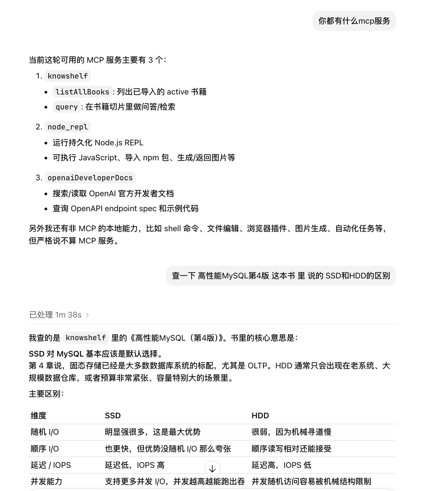

# Knowshelf

Knowshelf is a personal Markdown book knowledge base written in Go. It imports a Markdown book into local SQLite, splits it into parent/child chunks, retrieves with BM25 and vector search, fuses results with RRF, optionally reranks candidates, and exposes the system through CLI and MCP Streamable HTTP.

中文文档：[README-cn.md](./README-cn.md)

## Codex Usage Example



The main pipeline is:

```text
Markdown import
  -> parent/child chunks
  -> FTS5/gse + sqlite-vec retrieval
  -> RRF fusion
  -> optional rerank
  -> CLI/MCP output
```

## Project Scope

- One Markdown file is treated as one book.
- `parent_chunks` are context units that store larger section or paragraph text.
- `chunks` are retrieval units. BM25, embedding, vector search, and rerank all start from child chunks.
- Search results include both `chunk_id` and `parent_chunk_id`; the final text returned to the model comes from the parent chunk, so a short child hit can still bring enough surrounding context.
- Data is stored locally in SQLite, and vector search uses the `vec0` virtual table from `sqlite-vec`.

## Directory Layout

```text
cmd/knowshelf      CLI entrypoint and application lifecycle
internal/store     SQLite schema, import, FTS, and vector storage
internal/search    hybrid retrieval, RRF, rerank, and search logging
internal/models    embedding and rerank providers
internal/mcp       MCP Streamable HTTP server, tools, and middleware
internal/config    YAML config structs and logger setup
internal/segment   gse segmentation and FTS5 query construction
```

## Data Model

Main tables:

- `books`: book metadata, including source Markdown path, title, and timestamps.
- `parent_chunks`: context chunks, with `book_id`, `title`, `heading_path`, and `text`.
- `chunks`: child chunks, with `book_id`, `parent_chunk_id`, `title`, `heading_path`, and `text`.
- `chunks_fts`: FTS5 table for BM25 retrieval.
- `embeddings`: records which child chunks already have embeddings.
- `chunk_vectors`: sqlite-vec vector table where `rowid = chunks.id`.

## Import Flow

CLI import flow:

1. Copy the input Markdown file into `library.markdown_dir`.
2. Call `store.ImportMarkdown` with the copied basename.
3. Extract the title from frontmatter `title`; if absent, use the first Markdown heading; if still absent, use the filename.
4. Use Eino's Markdown header splitter to split by heading structure.
5. Use a recursive splitter to produce parent chunks, with a default limit of `2000` runes.
6. Split each parent chunk into child chunks, with a default limit of `1000` runes.
7. Skip empty chunks and heading-only chunks.
8. In one transaction, update `books`, `parent_chunks`, `chunks`, and `chunks_fts`, and delete old embedding/vector rows.

Default chunk parameters live in `internal/store/chunk.go`:

```text
defaultParentChunkRunes = 2000
defaultChildChunkRunes  = 1000
defaultOverlapRunes     = 0
```

## Retrieval Flow

Knowshelf has one hybrid retrieval pipeline:

1. Run BM25 with the original question.
2. Run BM25 with caller-provided `rewrittenQueries`.
3. Run vector retrieval for the original question, rewritten queries, and `hypotheticalAnswer`.
4. Fuse all retrieval lists with RRF, using weights from `search.rrf_weights`.
5. Aggregate by parent chunk, so multiple child hits under the same parent contribute to one result.
6. Truncate to `candidate_limit`.
7. If rerank is enabled, send parent texts to the rerank provider.
8. Blend RRF position score and rerank score, filter by `min_score`, and truncate by limit.

## Features

### CLI

Common commands are wrapped by `make`:

```bash
make build
make run
make import
make embed
make embed_show
make embed_export
```

### MCP Service

The `run` command starts the MCP Streamable HTTP service:

```text
MCP endpoint: /mcp
health check: /healthz
```

Current MCP tools:

- `query`: search book chunks by question, with optional `bookID`, `rewrittenQueries`, `hypotheticalAnswer`, and `limit`.
- `listAllBooks`: list all imported active books with `id` and `title`.

MCP supports optional auth and CORS:

- Auth uses bearer tokens.
- `token_gen` can generate signed tokens from `mcp.auth.secret`.
- CORS is configured under `mcp.cors`.

### Embeddings And Vectors

`embed` finds active child chunks without embeddings, calls the configured embedding provider, and saves results to:

```text
embeddings.chunk_id = chunks.id
chunk_vectors.rowid = chunks.id
```

The current vector dimension is fixed at `1024`; writes to `chunk_vectors` validate this dimension.

`embed show` displays vector rows together with child text. `embed export` exports files compatible with TensorFlow Embedding Projector:

```text
vectors.tsv
metadata.tsv
```

## Configuration

Start from the example config:

```bash
cp config.example.yaml config.yaml
```

Main configuration keys:

- `database.path`: SQLite database path.
- `library.markdown_dir`: directory where imported Markdown files are stored.
- `segment.dictionaries`: gse dictionaries.
- `search.default_limit`: default number of search results.
- `search.candidate_limit`: candidate limit after RRF and before rerank.
- `search.min_score`: minimum final score.
- `search.rrf_weights`: RRF weights for each retrieval source.
- `search.enable_vector`: whether to enable vector retrieval and the embedding provider.
- `search.enable_rerank`: whether to enable the rerank provider.
- `models.embedding`: embedding provider configuration.
- `models.rerank`: rerank provider configuration.
- `mcp`: HTTP address, path, auth, CORS, and session settings.
- `observability.trace`: OpenTelemetry tracing configuration.

To run BM25 only, disable both switches:

```yaml
search:
  enable_vector: false
  enable_rerank: false
```

To use vector retrieval, configure an embedding provider and make sure it returns `1024` dimensions. To enable rerank, configure the rerank provider and model.

## Notes

- `chunk_vectors` is a sqlite-vec `vec0` virtual table. Ordinary SQLite GUI tools may not be able to open it unless they load sqlite-vec.
- Re-importing the same book replaces its old parent/child chunks, FTS rows, and vector rows.
